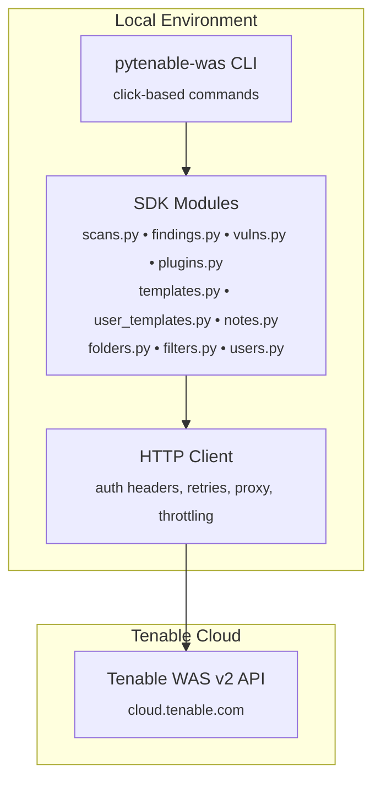

## Architecture Overview (Mermaid Diagram)

```mermaid
flowchart TD

    CLI["pytenable-was CLI<br/><sub>click-based commands</sub>"]
    SDK["SDK Modules<br/><sub>scans.py • findings.py • vulns.py • plugins.py<br/>templates.py • user_templates.py • notes.py<br/>folders.py • filters.py • users.py</sub>"]
    HTTP["HTTP Client<br/><sub>auth headers, retries, proxy, throttling</sub>"]
    TENABLE["Tenable WAS v2 API<br/><sub>cloud.tenable.com</sub>"]

    CLI --> SDK
    SDK --> HTTP
    HTTP --> TENABLE

    subgraph LocalEnvironment["Local Environment"]
        CLI
        SDK
        HTTP
    end

    subgraph TenableCloud["Tenable Cloud"]
        TENABLE
    end
```
